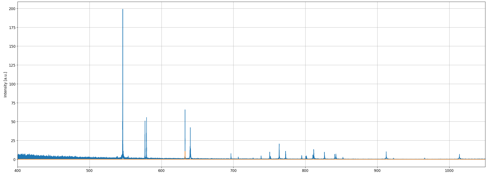

[](https://zenodo.org/badge/latestdoi/246357643)
# Interferometry

Some analysis code for correcting a Michelson interferometer. Developed for the second year interferometry lab of the Imperial Physics degree.

# Usage

The project is composed of two parts. `DAQ.sh` facilitates an easier interface for use in data acquisition. Calling `DAQ.sh -h` displays an in depth help on usage. Don't forget to make the file executable via `chmod +x DAQ.sh` and to run type `./DAQ.sh` if it is in the current directory. `DAQ.sh` creates a datafile, that also has metadata attached for use in the analysis script. As most of these metadata is usually recorded, the usage of `DAQ.sh` for data taking is not required for the use of `data_corr.py` as the input dataformat can easily be forged.

The second part of the project is `data_corr.py`. This script takes 9 arguments. As such it can only be called from the command line. I recommend the ipython console to run it simply open a terminal in the folder, where this file is and type ipython/ipython3. This should open the ipython console. To run the script try:

```
%run data_corr.py data.csv correction_interval starting_index end_index correction_fineness correction_treshold reference_wavelength averaging_interval interation_num
```

As mentioned above data.csv is the output of `DAQ.sh`. The output of the lab provided data acquisition software adn this only differs by some metadata included in the first line. The general format is:

detector_dev,start_pos,end_pos,speed,frequency,**datapoint_spacing**,**nullpoint**

Only the bold parameters are required, and the rest are only included for completeness. The nullpoint is semi-optional as well, because it is only used to link the corrected measuerements to the initial ones. As long as there is a number for the nullpoint the correction. By adding this line to the start of the dataset it can be then analysed. The datapoint spacing can be calculated by dividing the speed with the frequency.

The parameters for analysis and their role:
- correction_interval: Determines the step taken after each correction (i.e. for 1 every point is corrected one after an other while for 2 every second point is corrected, and the rest are corrected in a second run). Recomended: 1
- starting_index,end_index: The data is only considered between these two indicies, the rest are culled. 2100 datapoints are culled from the start either way, and similarly a 1000 are culled from the end. These values only increase this amount.
- correction_fineness: defines how small the step size should be. Higher number means finer correction, but longer runtime. Recommended is around 1e9.
- correction_treshold: defines at what deviation to stop the correction. The larger correction_fineness is the smaller this can be. If run crashes with KeyError this is too small or correction_fineness is too large. Recommended to set to around 0.01.
- reference_wavelength: The wavelength of the reference signal in meters.
- averaging_interval: The smallest interval on which the background removal/normalisation is done. Recomended 20 datapoints.
- interation_num: The number of iterations, background removal and normalisation go through before stopping.

# Algorithm

The steps the program takes to correct the spectrum are:
1. The dataset is sorted.
2. The reference is fitted with a linear background, which is removed afterwards.
3. The reference goes through a second background removal, in which a moving average of the datapoints are averaged, and the moving average is removed from the data. This is iterated for smaller and smaller amounts of data being included in the moving average until only averaging_interval remains.
4. A new moving average is generated representing the average size of the deviation from zero. For sine waves this average should be 2/pi. The datapoints are adjusted via multiplication so the moving average resembles 2/pi. This is repeated interation_num times as well until the moving average only contains averaging_interval amount of datapoints.
5. Datapoints that lie beyond [-1;1] are discarded.
6. A theoretical reference is fitted to the data.
7. The nearest point on the theoretical reference is found by iteration for each datapoint. The point is moved and corrected to the reference.
8. FFT is taken and intensity profile is corrected.

# Results

An example run produced with this script:

